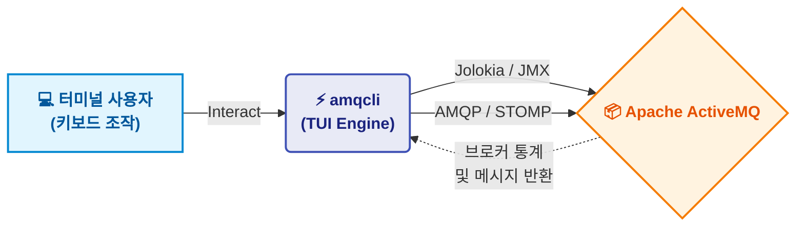

<p align="center">
  
</p>

<h1 align="center">💫 amqcli — ActiveMQ TUI Client</h1>

<p align="center">
  <b>터미널 환경에서 Apache ActiveMQ 브로커를 손쉽게 관리하세요.</b><br>
  메시지 조회, 큐 관리, 통계 모니터링 기능이 세련된 TUI 환경에서 모두 제공됩니다.
</p>

<p align="center">
  
  
  
  
  
  <a href="README.md"></a>
</p>

---

## 프로젝트 개요

**amqcli**는 [Apache ActiveMQ](https://activemq.apache.org/) 브로커를 손쉽게 관리하고 모니터링하기 위해 설계된 **TUI(Terminal User Interface)** 도구입니다. Go 언어와 [charmbracelet/bubbletea](https://github.com/charmbracelet/bubbletea) 프레임워크 기반으로 개발되어, 웹 관리자 콘솔을 대체할 수 있는 빠르고 키보드 친화적인 환경을 제공합니다.

Jolokia(JMX) 및 AMQP/STOMP 프로토콜과 직접 연동되므로, 터미널을 벗어나지 않고도 강력한 ActiveMQ 관리 기능을 모두 경험할 수 있습니다.



---

## 실행 화면


---

## 주요 기능

<table>
<tr><td><b>TUI 기반 환경</b></td><td>Bubbletea로 구동되는 최신 크로스 플랫폼 터미널 인터페이스를 통해 부드러운 네비게이션과 Catppuccin 컬러 테마를 제공합니다. (구형 VT100 자동 Fallback 지원)</td></tr>
<tr><td><b>큐(Queue) 관리</b></td><td>모든 큐의 목록과 소비자(Consumer) 수, Enqueue/Dequeue 메트릭을 실시간으로 확인하고 큐 생성, 퍼지(Purge), 삭제 작업을 지원합니다.</td></tr>
<tr><td><b>메시지 조회</b></td><td>UI 환경 내에서 큐 내부의 메시지를 직접 조회하고, 메시지 속성과 페이로드(Payload), Correlation ID 등을 상세히 확인할 수 있습니다.</td></tr>
<tr><td><b>메시지 전송</b></td><td>AMQP 1.0 또는 STOMP 프로토콜을 통해 타겟 큐로 메시지를 즉시 전송할 수 있습니다.</td></tr>
<tr><td><b>브로커 통계</b></td><td>큐 리스트 화면에서 단축키(U)로 시스템 리소스(CPU, 메모리, 디스크) 사용량 및 스토어 크기 등의 상태를 토글하여 확인할 수 있습니다.</td></tr>
<tr><td><b>고급 삭제 기능</b></td><td>한 번에 여러 개의 메시지를 일괄 삭제하거나, 특정 시간 이전에 생성된 메시지를 필터링하여 일괄 삭제할 수 있습니다.</td></tr>
<tr><td><b>연결(Connection) 정보</b></td><td>활성화된 클라이언트 연결 정보, 리모트 주소, 유지 시간(Uptime) 등을 조회하여 브로커의 상태를 점검할 수 있습니다.</td></tr>
</table>

---

## 요구 사항

`amqcli`는 단일 바이너리로 정적 컴파일(Statically compiled) 되므로, 실행 시 **외부 라이브러리 의존성을 요구하지 않습니다**.

| 도구 | 목적 |
|------|---------|
| [Apache ActiveMQ](https://activemq.apache.org/) | 대상 메시지 브로커입니다. 내부적으로 Jolokia(REST API) 및 AMQP/STOMP 포트 접근이 허용되어야 정상 작동합니다. |

---

## 설치 방법

다음 방법 중 하나를 선택하여 `amqcli`를 설치할 수 있습니다.

### 1. Homebrew (macOS / Linux)
커스텀 탭을 통해 Homebrew로 매우 간단하게 설치 및 업그레이드할 수 있습니다:
```bash
brew tap xvlet/amqcli
brew install amqcli
```

### 2. 간편 설치 스크립트 (Quick Install)
운영체제에 맞는 설치 스크립트를 사용하여 최신 릴리즈를 가장 쉽게 설치하는 방법입니다.

**macOS / Linux (Shell)**
```bash
curl -fsSL https://raw.githubusercontent.com/xvlet/amqcli/master/install.sh | sh
```

**Windows (PowerShell)**
```powershell
powershell -ExecutionPolicy Bypass -c "irm https://raw.githubusercontent.com/xvlet/amqcli/master/install.ps1 | iex"
```

### 3. Go 명령어 사용 (go install)
Go(1.25 이상)가 설치된 환경이라면 `go install` 명령어로 쉽게 설치할 수 있습니다:
```bash
go install github.com/xvlet/amqcli/cmd/amqcli@latest
```

### 4. 컴파일된 바이너리 다운로드
Go가 설치되어 있지 않고 실행 파일만 바로 사용하고 싶다면, 최신 릴리즈에서 바이너리를 직접 다운로드하세요.
- [Releases 페이지에서 바이너리 다운로드](https://github.com/xvlet/amqcli/releases)

다운로드 후 압축을 풀고 실행 권한을 부여한 뒤 실행합니다:
```bash
tar -xzf amqcli_linux_amd64.tar.gz
chmod +x amqcli
./amqcli -h
```

### 5. Docker (GHCR)
GitHub Container Registry(GHCR)를 통해 배포되는 공식 Docker 이미지를 이용해 바로 실행할 수 있습니다:
```bash
docker run -it --rm -v $(pwd)/config.yml:/app/config.yml ghcr.io/xvlet/amqcli:latest
```
> **주의:** 이 명령어를 실행하기 **전**에 현재 디렉토리에 반드시 `config.yml` 파일이 존재해야 합니다. 로컬에 파일이 없을 경우 Docker가 이를 폴더(디렉토리)로 인식하고 생성하여 마운트하므로 실행 에러가 발생합니다.

---

## 시작하기

### 1. 설정 파일 (`config.yml`) 구성

`amqcli`는 환경(예: `dev`, `prod`) 단위로 브로커를 관리하기 위해 `config.yml` 설정 파일을 사용합니다. 실행 파일과 동일한 경로에 파일을 생성하세요.

```yaml
# config.yml 예시
refresh_interval: 1s
encoding: utf-8
environments:
  dev:
    protocol: "stomp"  # 또는 "amqp"
    host: "${MQ_HOST:-127.0.0.1}"
    stomp_port: "61613" # 선택 사항 (기본값: 61613)
    web_port: "8161"    # 선택 사항 (기본값: 8161)
    username: "${MQ_USER:-admin}"
    password: "${MQ_PASS:-admin}"
  prod:
    protocol: "amqp"
    host: "10.0.0.5"
    amqp_port: "5672"   # 선택 사항 (기본값: 5672)
    web_port: "8161"    # 선택 사항 (기본값: 8161)
    username: "admin"
    password: "prod-password"
```

> 💡 **환경 변수 치환 지원 (Environment Variable Substitution)**
> `config.yml` 파일 내에서 `${ENV_VAR:-default_value}` 문법을 사용할 수 있습니다. 
> 예를 들어 `${MQ_HOST:-127.0.0.1}`은 시스템에 `MQ_HOST` 환경 변수가 설정되어 있으면 그 값을 사용하고, 없다면 기본값인 `127.0.0.1`을 사용한다는 의미입니다. 비밀번호나 주요 설정값을 하드코딩하지 않고 시스템 환경 변수로 안전하게 주입할 때 유용합니다.

### 2. amqcli 실행

```bash
# 기본 환경설정('dev')으로 실행할 경우
./amqcli

# config.yml 내에 정의된 특정 환경('prod')으로 실행할 경우
./amqcli -env prod
```

### 3. 주요 단축키

- `↑` / `↓` : 상하 항목 이동
- `Enter` : 항목 선택 / 큐 내부 메시지 조회 / 메시지 상세 보기
- `Space` : 메시지 리스트에서 다중 선택 (Multi-select)
- `C` : 새 큐 생성 (Create)
- `S` : 메시지 전송 (Send)
- `P` : 큐 비우기 (Purge) / 메시지 리스트에서 기간 단위 삭제 팝업 열기
- `D` : 큐 삭제 / 다중 선택된 메시지 일괄 삭제
- `M` : 메시지 이동 (상세 화면에서 타 큐로 이동)
- `R` : 메시지 재시도 (상세 화면에서 DLQ 재처리 등에 사용)
- `I` : 큐 통계 및 상세 정보 확인 (Info)
- `N` : 활성 연결(Connection) 목록 조회
- `U` : 시스템 Usage 통계(Memory/Disk/CPU 등) 토글 표시
- `F3` / `Ctrl+F` : 메시지 검색 (Search)
- `Esc` : 뒤로 가기
- `q` / `Ctrl+C` : 애플리케이션 종료

---

## 고급 설정

### Client ID 포맷팅 및 연동 (Advanced)

AMQP나 STOMP 클라이언트를 직접 개발할 때, `amqcli`의 연결(Connection, `N`) 및 컨슈머 목록 화면에서 클라이언트의 **Uptime(실행 시간)**과 **PID(프로세스 ID)**가 예쁘게 노출되도록 연동할 수 있습니다.

`amqcli`는 클라이언트가 브로커에 접속할 때 제출하는 `client-id` (STOMP) 혹은 `ContainerID` (AMQP) 문자열 내부에서 다음 데이터를 자동 추출합니다:
- **PID**: 4~8자리의 연속된 숫자
- **Timestamp**: 10~14자리의 Unix Timestamp (초 또는 밀리초)

**권장 포맷**:
```text
[어플리케이션명]-[PID]-[UnixTimestamp]-[WorkerID (또는 DrainerID)]
```

**적용 예시 (Go 언어)**:
```go
// 12345 = PID, 1698765432000 = Unix Timestamp(ms)
clientID := fmt.Sprintf("my-worker-%d-%d", os.Getpid(), time.Now().UnixMilli())
```
위와 같은 형식으로 클라이언트 ID를 지정해주면 `amqcli` 환경에서 여러분이 만든 클라이언트 프로세스들의 상태를 훨씬 직관적으로 모니터링할 수 있습니다!
