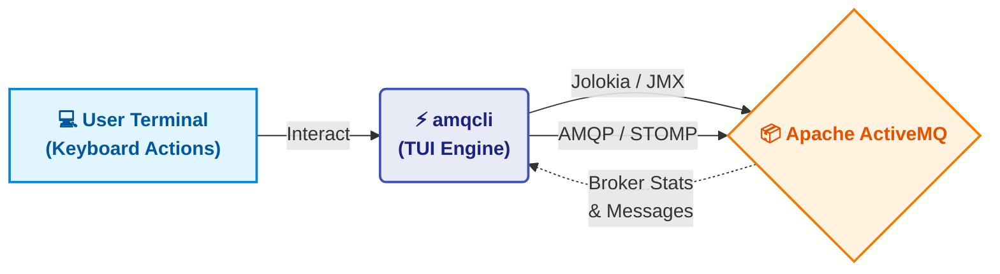

<p align="center">
  
</p>

<h1 align="center">💫 amqcli — ActiveMQ TUI Client</h1>

<p align="center">
  <b>Manage your Apache ActiveMQ brokers right from the terminal.</b><br>
  Browse messages. Manage queues. Monitor statistics. All within a modern TUI.
</p>

<p align="center">
  
  
  
  
  
  <a href="README.ko-KR.md"></a>
</p>

---

## Overview

**amqcli** is a high-performance, **Terminal User Interface (TUI)** tool designed to simplify the management and monitoring of [Apache ActiveMQ](https://activemq.apache.org/) brokers. Built using Go and [charmbracelet/bubbletea](https://github.com/charmbracelet/bubbletea), it provides a fast, keyboard-driven alternative to web-based administration consoles.

By integrating Jolokia (JMX) and AMQP/STOMP protocols natively, `amqcli` offers a rich ecosystem of features without leaving your terminal environment.



---

## Key Features

<table>
<tr><td><b>TUI Experience</b></td><td>Modern, cross-platform terminal interface powered by Bubbletea, providing fluid navigation and color-rich Catppuccin themes with VT100 fallback.</td></tr>
<tr><td><b>Queue Management</b></td><td>List all queues, view consumer counts, enqueued/dequeued metrics. Support for creating, purging, and deleting queues.</td></tr>
<tr><td><b>Message Browsing</b></td><td>Browse messages inside queues directly from the UI, view detailed properties, payloads, and correlation IDs.</td></tr>
<tr><td><b>Message Sending</b></td><td>Quickly send messages to a target queue directly via AMQP 1.0 or STOMP protocols.</td></tr>
<tr><td><b>Broker Statistics</b></td><td>Toggle in-depth system usage (CPU, Memory, Disk) and broker storage limits directly on the queue list.</td></tr>
<tr><td><b>Advanced Deletion</b></td><td>Delete multiple messages at once or filter messages older than a specific time frame.</td></tr>
<tr><td><b>Connection Info</b></td><td>Inspect active client connections, remote addresses, and uptime to monitor broker health.</td></tr>
</table>

---

## Quick Start

### 1. Configuration (`config.yml`)

`amqcli` uses a `config.yml` file to manage different environments (e.g., `dev`, `prod`). Place `config.yml` in the same directory as the executable.

```yaml
# Example config.yml
refresh_interval: 1s
encoding: utf-8
environments:
  dev:
    protocol: "stomp"  # or "amqp"
    host: "${MQ_HOST:-127.0.0.1}"
    stomp_port: "61613" # optional (default: 61613)
    web_port: "8161"    # optional (default: 8161)
    username: "${MQ_USER:-admin}"
    password: "${MQ_PASS:-admin}"
  prod:
    protocol: "amqp"
    host: "10.0.0.5"
    amqp_port: "5672"   # optional (default: 5672)
    web_port: "8161"    # optional (default: 8161)
    username: "admin"
    password: "prod-password"
```

### 2. Run amqcli

```bash
# Run with default environment ('dev')
./amqcli

# Specify a different environment from config.yml
./amqcli -env prod
```

### 3. Keyboard Shortcuts

- `↑` / `↓` : Navigate items.
- `Enter` : Select / Browse Queue / View Message Details.
- `C` : Create Queue.
- `S` : Send Message.
- `P` : Purge Queue.
- `D` : Delete Queue / Message.
- `I` : View Queue Info & Statistics.
- `N` : View active Connections.
- `U` : Toggle System Usage (Memory/Disk/CPU).
- `F3` / `Ctrl+F` : Search messages.
- `Esc` : Go Back.
- `q` / `Ctrl+C` : Quit application.

---

## Installation

You can install `amqcli` using one of the following methods. The `amqcli` binary is distributed as a statically linked executable (`CGO_ENABLED=0`), ensuring it runs independently without any external dependency issues.

### 1. Homebrew (macOS / Linux)
You can easily install or upgrade `amqcli` using Homebrew via our custom tap:
```bash
brew tap xvlet/amqcli
brew install amqcli
```

### 2. Quick Install Scripts
The easiest way to install the latest release is by using the provided installation scripts for your operating system.

**macOS / Linux (Shell)**
```bash
curl -fsSL https://raw.githubusercontent.com/xvlet/amqcli/master/install.sh | sh
```

**Windows (PowerShell)**
```powershell
powershell -ExecutionPolicy Bypass -c "irm https://raw.githubusercontent.com/xvlet/amqcli/master/install.ps1 | iex"
```

### 3. Using Go (go install)
If you have Go (1.25+) installed, you can easily install `amqcli` via `go install`:
```bash
go install github.com/xvlet/amqcli/cmd/amqcli@latest
```

### 4. Download Pre-built Binary
If you don't have Go installed and just want to use the executable, download the latest pre-built release.
- [Download binary from Releases](https://github.com/xvlet/amqcli/releases)

After downloading, extract the archive and run it:
```bash
tar -xzf amqcli_linux_amd64.tar.gz
chmod +x amqcli
./amqcli -h
```

### 5. Docker (GHCR)
You can run `amqcli` directly via Docker using our official image hosted on GitHub Container Registry (GHCR):
```bash
docker run -it --rm -v $(pwd)/config.yml:/app/config.yml ghcr.io/xvlet/amqcli:latest
```

---

## Prerequisites

`amqcli` is a statically compiled Go binary with **no external dependencies required** to run.

| Tool | Purpose |
|------|---------|
| [Apache ActiveMQ](https://activemq.apache.org/) | Target broker to manage. Ensure Jolokia / REST API and AMQP/STOMP ports are accessible. |
